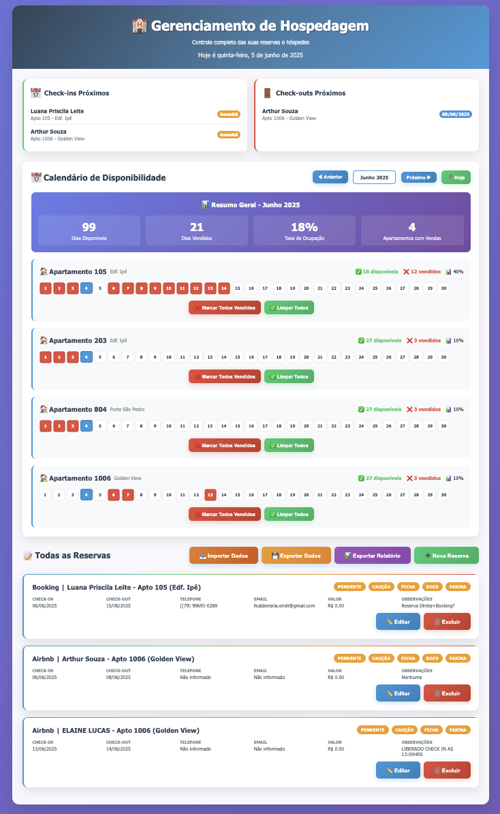
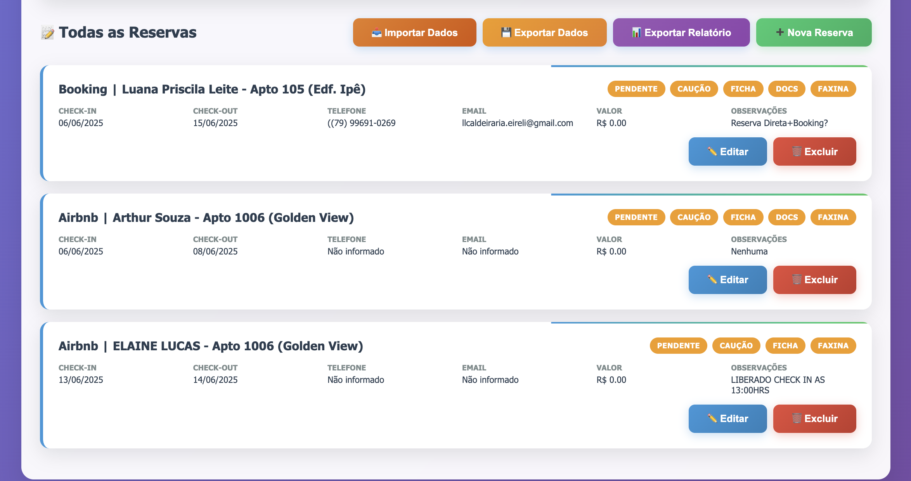
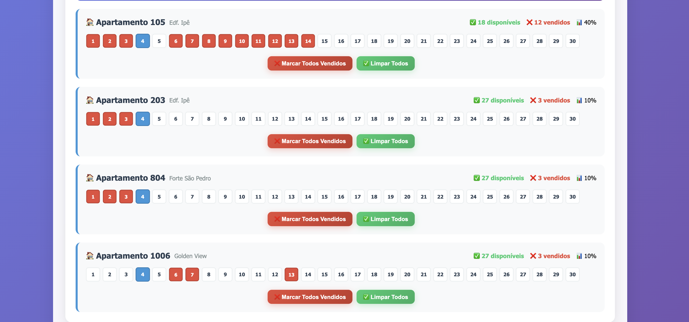
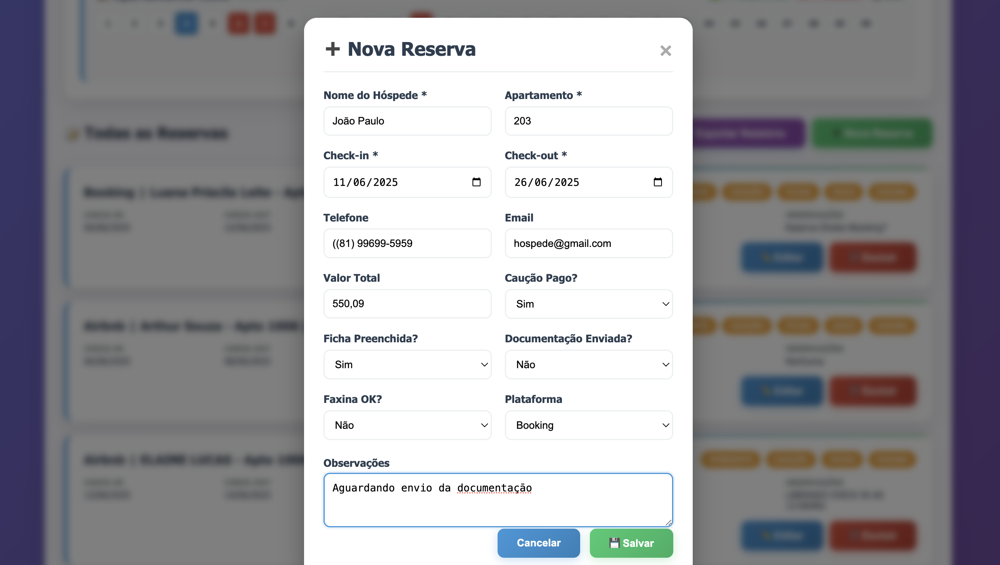

# 🏨 Sistema de Gerenciamento de Hospedagem

> Uma solução completa para gestão de apartamentos no Airbnb, desenvolvida para facilitar o controle de reservas, hóspedes e disponibilidade.


## 🔗 Demo Online

**[🌐 Acesse o sistema aqui](https://vanessa-rafaella.github.io/airbnb-management-system)**

## 📸 Screenshots

### 🖥️ Dashboard Completo - Visão Geral do Sistema

*Tela principal mostrando check-ins próximos, calendário de disponibilidade e lista de reservas*

### 📋 Gestão de Reservas - Interface Intuitiva  

*Sistema de badges visuais para controle de status: caução, documentos, ficha e faxina*

### 📅 Calendário de Disponibilidade - Controle Visual

*Calendário individual por apartamento com estatísticas de ocupação em tempo real*

### ➕ Modal de Nova Reserva - Cadastro Simples

*Formulário completo e organizado para cadastro rápido de hóspedes*

## 🎯 O Problema que Resolvi

Este projeto nasceu de uma necessidade real: minha avó possui 4 apartamentos no Airbnb e estava se perdendo entre planilhas Excel, anotações em papel e lembretes espalhados. 

**Desafios identificados:**
- ❌ Controle manual de reservas em múltiplas plataformas
- ❌ Esquecimento de pendências importantes (caução, documentos)
- ❌ Dificuldade para visualizar disponibilidade
- ❌ Falta de lembretes para check-ins/check-outs
- ❌ Relatórios desorganizados

## ✨ A Solução Desenvolvida

### 📋 Gestão Completa de Reservas
- ✅ Cadastro detalhado de hóspedes e apartamentos
- ✅ Controle de status (caução, documentos, faxina, ficha)
- ✅ Suporte a múltiplas plataformas (Airbnb, Booking, Decolar)
- ✅ Sistema de badges visuais para status das reservas

### 📅 Calendário Inteligente de Disponibilidade
- ✅ Visualização mensal por apartamento
- ✅ Marcação rápida de dias vendidos/disponíveis
- ✅ Estatísticas de ocupação em tempo real
- ✅ Navegação fluida entre meses e anos
- ✅ Destaque automático do dia atual

### 🔔 Sistema de Alertas e Lembretes
- ✅ Painel de check-ins próximos (ontem, hoje, amanhã)
- ✅ Alertas de check-outs iminentes
- ✅ Notificações de pendências atrasadas
- ✅ Sugestões automáticas para otimização de vendas

### 💾 Backup e Relatórios Profissionais
- ✅ Exportação segura de dados em JSON
- ✅ Relatórios detalhados em formato TXT
- ✅ Importação com backup automático dos dados anteriores
- ✅ Relatórios de disponibilidade por mês/apartamento

## 🛠️ Tecnologias Utilizadas

### Frontend
- **HTML5 Semântico** - Estrutura moderna e acessível
- **CSS3 Avançado** - Grid Layout, Flexbox, Animações
- **JavaScript ES6+** - Funcionalidades reativas e interativas

### Funcionalidades Técnicas
- **LocalStorage API** - Persistência de dados no navegador
- **Responsive Design** - Mobile-first com CSS Grid e Flexbox
- **Timezone Handling** - Cálculos precisos para fuso horário brasileiro
- **File API** - Import/export de dados
- **DOM Manipulation** - Interface dinâmica e reativa

### UX/UI Design
- **Material Design Principles** - Interface intuitiva
- **Progressive Enhancement** - Funciona sem JavaScript básico
- **Accessibility** - Navegação por teclado e screen readers
- **Performance** - Carregamento instantâneo, zero dependências

## 🚀 Como Usar

### Método 1: Acesso Online (Recomendado)
1. **Acesse:** [vanessa-rafaella.github.io/airbnb-management-system](https://vanessa-rafaella.github.io/airbnb-management-system)
2. **Use imediatamente** - não precisa instalar nada!

### Método 2: Download Local
```bash
# Clone o repositório
git clone https://github.com/vanessa-rafaella/airbnb-management-system.git

# Entre na pasta
cd airbnb-management-system

# Abra no navegador
open index.html
```

### Método 3: Fork para Personalizar
1. Clique em **"Fork"** no topo desta página
2. Customize para suas necessidades
3. Ative GitHub Pages nas configurações do seu fork

## 📱 Compatibilidade

✅ **Desktop:** Chrome, Firefox, Safari, Edge (últimas versões)  
✅ **Tablet:** iPad, Android tablets  
✅ **Mobile:** iOS Safari, Chrome Android  
✅ **Offline:** Funciona sem conexão após primeira visita  

## 🏗️ Arquitetura do Projeto

```
📁 airbnb-management-system/
├── 📄 index.html              # Aplicação principal (HTML + CSS + JS)
├── 📄 README.md               # Esta documentação
├── 📁 screenshots/            # Capturas de tela do sistema
│   ├── 📸 dashboard.png
│   ├── 📸 calendario.png
│   └── 📸 mobile.png
└── 📄 LICENSE                 # Licença MIT
```

## 💡 Destaques Técnicos

### Performance
- **Zero dependências** externas
- **Carregamento < 2s** em conexões 3G
- **100% offline** após primeira visita
- **Otimizado** para dispositivos de baixa potência

### Segurança
- **Dados locais** - nunca enviados para servidores
- **Backup automático** antes de importações
- **Validação** de entrada de dados
- **Sanitização** de inputs do usuário

### Manutenibilidade
- **Código limpo** e bem documentado
- **Funções modulares** e reutilizáveis
- **Separação clara** de responsabilidades
- **Comentários** em português para facilitar manutenção

## 🔮 Roadmap - Próximas Funcionalidades

### Versão 2.0 (Em planejamento)
- [ ] **API Integration** - Sincronização automática com Airbnb/Booking
- [ ] **PWA** - Instalação como app no celular
- [ ] **Push Notifications** - Lembretes automáticos
- [ ] **Dashboard Financeiro** - Controle de receitas e despesas

### Versão 2.1
- [ ] **Multi-idiomas** - Suporte para inglês e espanhol
- [ ] **Temas** - Modo escuro e personalização de cores
- [ ] **Integração WhatsApp** - Envio automático de mensagens
- [ ] **Relatórios avançados** - Gráficos e analytics

### Versão 3.0
- [ ] **Backend** - Sistema multi-usuário
- [ ] **Mobile App** - Aplicativo nativo
- [ ] **IA** - Sugestões inteligentes de preços
- [ ] **Integração PagSeguro/PicPay** - Controle financeiro completo

## 🤝 Como Contribuir

Contribuições são super bem-vindas! Veja como você pode ajudar:

### Para Desenvolvedores
1. **Fork** este repositório
2. **Clone** seu fork: `git clone https://github.com/SEU-USUARIO/airbnb-management-system.git`
3. **Crie uma branch** para sua feature: `git checkout -b feature/nova-funcionalidade`
4. **Faça suas alterações** e teste bem
5. **Commit** suas mudanças: `git commit -m 'feat: adiciona nova funcionalidade'`
6. **Push** para sua branch: `git push origin feature/nova-funcionalidade`
7. **Abra um Pull Request** com descrição detalhada

### Para Usuários
- 🐛 **Reporte bugs** abrindo uma [Issue](https://github.com/vanessa-rafaella/airbnb-management-system/issues)
- 💡 **Sugira melhorias** nas discussões
- ⭐ **Deixe uma estrela** se o projeto te ajudou
- 📢 **Compartilhe** com outros proprietários de hospedagem

### Padrões de Commit
```bash
feat: nova funcionalidade
fix: correção de bug
docs: atualização de documentação
style: formatação de código
refactor: refatoração sem mudança de funcionalidade
test: adição de testes
```

## 📊 Estatísticas do Projeto

- **Linhas de código:** ~2.000
- **Tempo de desenvolvimento:** 3 semanas
- **Apartamentos gerenciados:** 4 (projeto inicial)
- **Usuária principal:** Minha avó ❤️

## 🎓 O que Aprendi

Este projeto me ensinou muito sobre:

### Técnico
- **JavaScript avançado** - Manipulação de datas, localStorage, DOM
- **CSS Grid/Flexbox** - Layouts complexos e responsivos
- **UX/UI Design** - Interface para usuários não-técnicos
- **Performance** - Otimização sem frameworks

### Soft Skills
- **Análise de problemas** reais
- **Comunicação** com usuário final (minha avó!)
- **Documentação** clara e profissional
- **Gestão de projeto** pessoal

## 📄 Licença

Este projeto está licenciado sob a **MIT License** - veja o arquivo [LICENSE](LICENSE) para detalhes.

**Resumo:** Você pode usar, modificar e distribuir este código livremente, apenas mantenha os créditos originais.

## 👩‍💻 Sobre a Desenvolvedora

**Vanessa Rafaella**  
🎓 Estudante de Sistemas para Internet  - UNICAP
💻 Apaixonada por criar soluções que simplificam a vida das pessoas  

- **LinkedIn:** www.linkedin.com/in/vanessa-rafaella
- **GitHub:** [github.com/vanessa-rafaella](https://github.com/vanessa-rafaella)
- **Email:** imvanessarafaella@gmail.com

## 🙏 Agradecimentos

- **Minha avó** - Por confiar em mim e testar pacientemente cada versão
- **Comunidade dev** - Pelas inspirações e conhecimento compartilhado
- **Você** - Por visitar este projeto e talvez contribuir!

---

⭐ **Se este projeto te ajudou ou inspirou, deixe uma estrela!**

💬 **Dúvidas? Abra uma [Issue](https://github.com/vanessa-rafaella/airbnb-management-system/issues) ou me chame no [LinkedIn](https://linkedin.com/in/vanessa-rafaella)**

---

*Feito com ❤️ e muito ☕ por [Vanessa Rafaella](https://github.com/vanessa-rafaella)*
